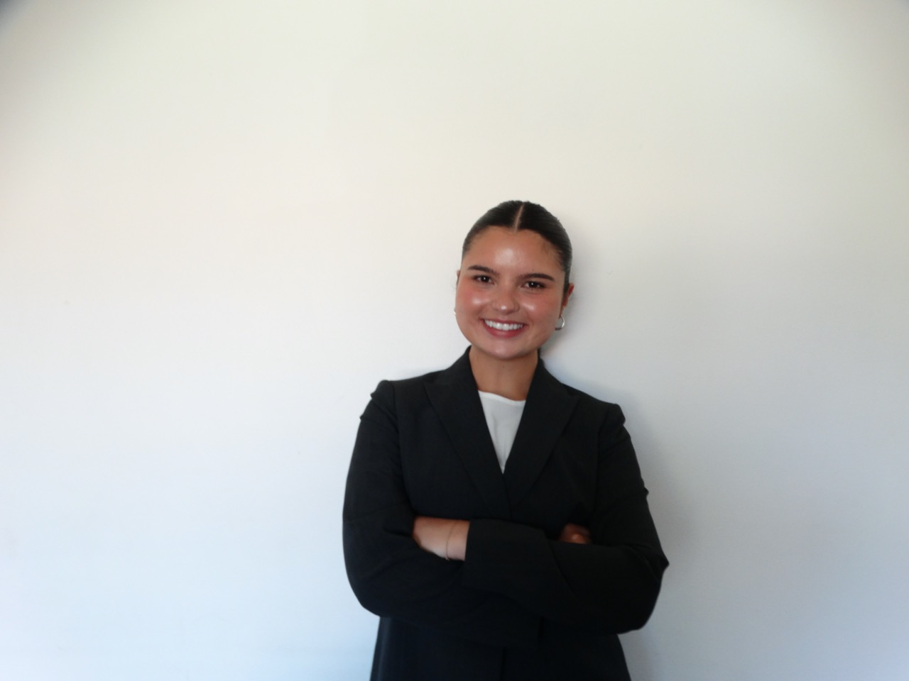

## Welcome

Hi, I’m Abigail Sewell, a marketing student with experience in content creation, social media management, branding, and digital storytelling.

## About Me

I use Canva, CapCut, and Adobe tools to create marketing content. I also run social media for Sospeso, where I create content that supports brand identity and audience engagement.

## Headshot

{width="250" fig-align="center"}

## Website Pages

This website includes:

-   A Home page
-   A Marketing Projects page
-   A Dashboard page
-   A Revealjs Presentation page
-   An Analytics page

## Skills

-   Social Media Management
-   Content Creation
-   Canva
-   CapCut
-   Adobe
-   Branding
-   Campaign Development
-   Marketing Analytics

## Career Goal

My goal is to build a career in marketing where I can combine creativity, strategy, and analytics to create strong brand experiences.

