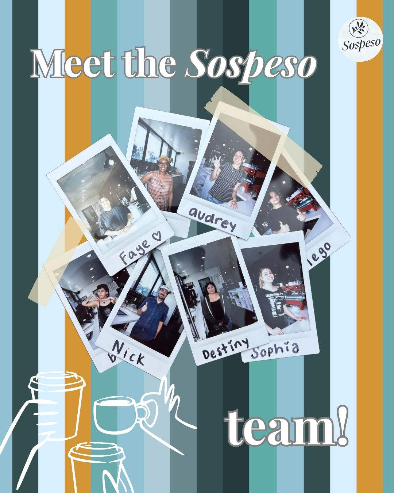
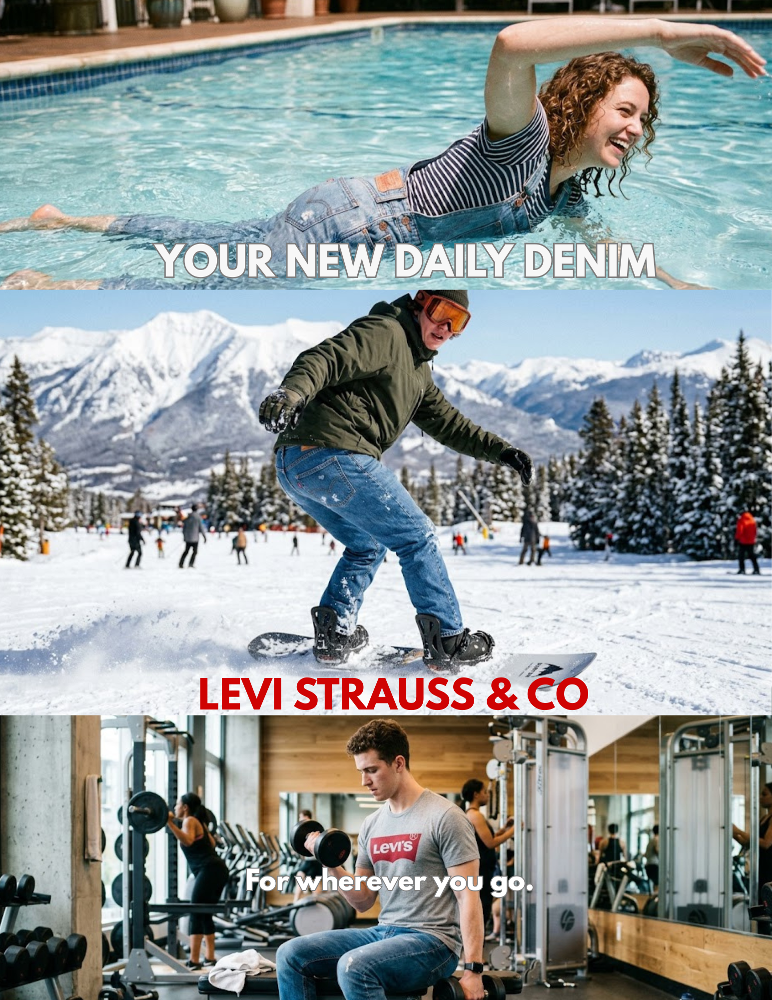

## Marketing Projects

This page highlights marketing work that reflects my experience in social media, branding, content creation, and campaign development.

## Sospeso Social Media Content

For Sospeso, I create and manage social media content that supports the cafe’s branding and customer engagement.

{width="500" fig-align="center"}

### Insights

-   Created content aligned with the cafe’s visual identity
-   Focused on clear and engaging brand communication
-   Helped strengthen audience connection through social media storytelling

## Meet the Team Project

This project introduced team members in a way that felt welcoming, professional, and visually engaging.

{width="500" fig-align="center"}

### Insights

-   Highlighted personality while maintaining a polished brand image
-   Used editing to improve visual flow and engagement
-   Supported trust and connection through people-focused content

## Mock Levi's Campaign

This mock Levi’s campaign reflected the brand’s style while promoting a clear campaign message.

{width="500" fig-align="center"}

### Insights

-   Applied brand-based creative direction
-   Focused on campaign visuals and message consistency
-   Demonstrated marketing strategy and design thinking

## Tools Used

-   Canva
-   CapCut
-   Adobe
